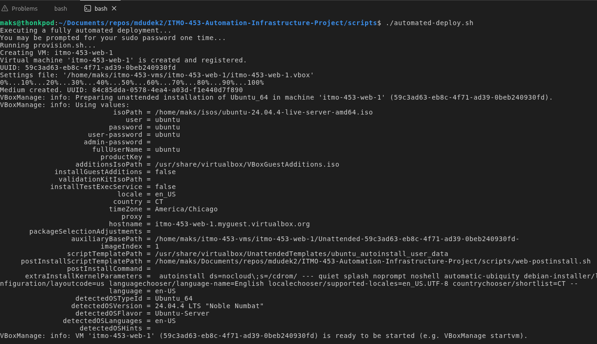
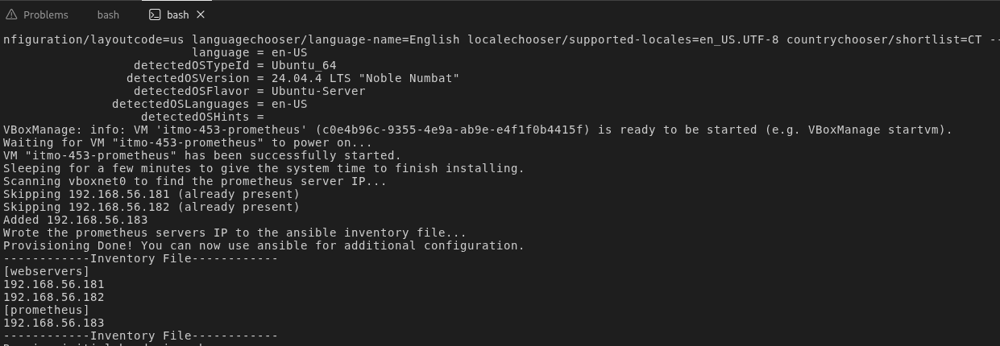
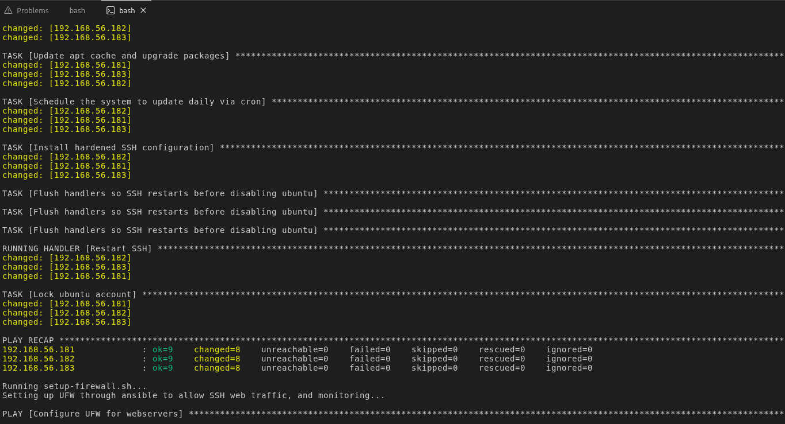
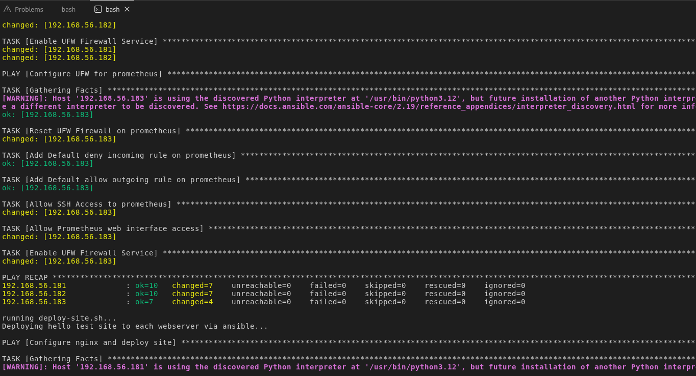
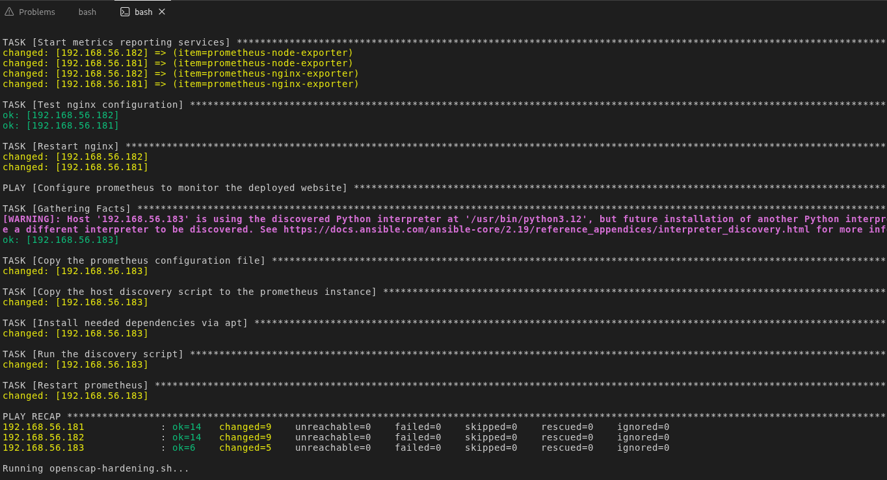
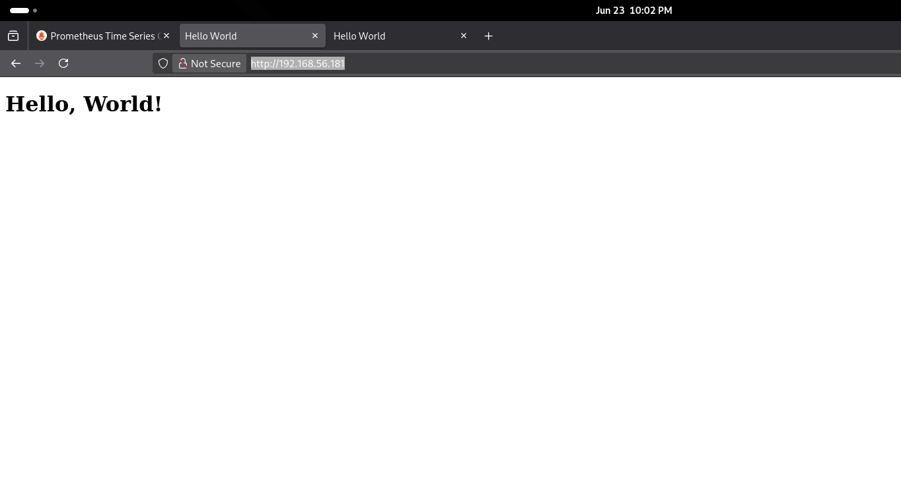
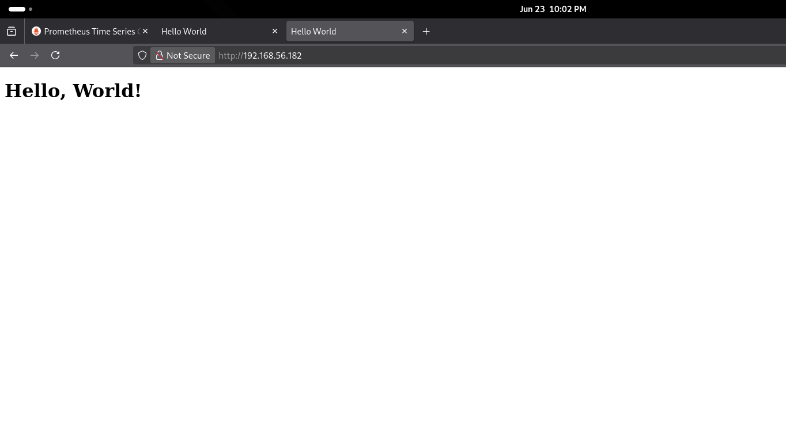
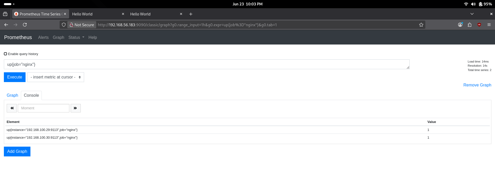
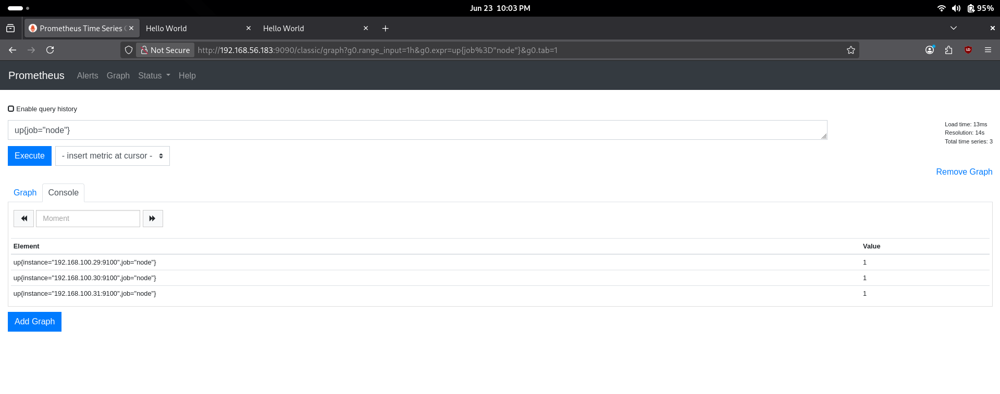
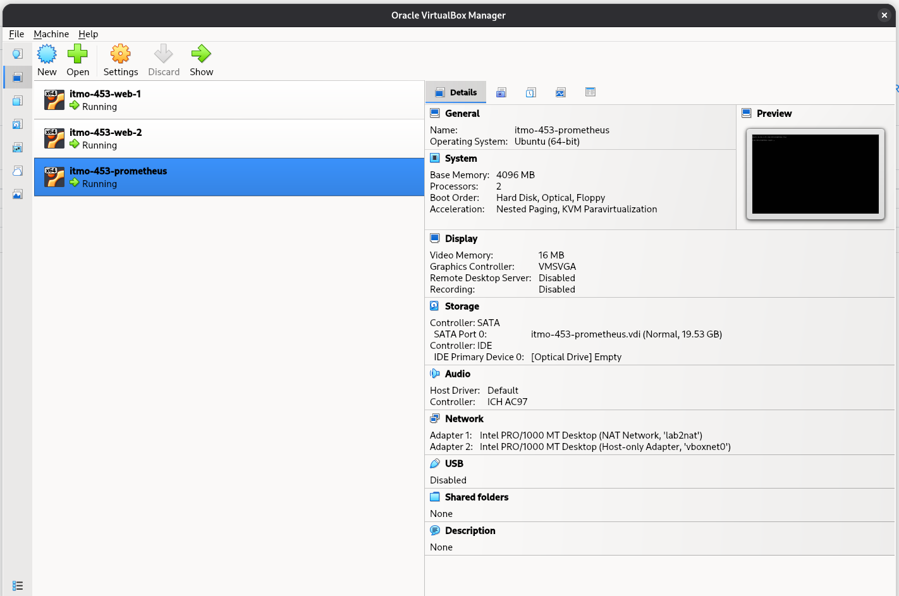

# Screenshots Demonstrating Successful Deployment

## Running the provisioning script

## Provisioning Script Complete

## Initial Hardening

## Firewall Setup

## Service Deployment

## First Webserver

## Second Webserver

## Prometheus Monitoring for nginx

## Prometheus Monitoring for Node

## Virtualbox Menu

